# Updating Gerrit Index Schema Versions

- [Updating Gerrit Index Schema Versions](#updating-gerrit-index-schema-versions)
  - [Concept](#concept)
    - [How online index schema upgrade works](#how-online-index-schema-upgrade-works)
      - [Background reindexing task](#background-reindexing-task)
      - [Write indexes set and search index](#write-indexes-set-and-search-index)
    - [Optimizing online reindexing](#optimizing-online-reindexing)
    - [Optimizations with local Lucene index](#optimizations-with-local-lucene-index)
    - [Reusing existing index documents](#reusing-existing-index-documents)
    - [Preparing a new index schema version before index schema upgrade](#preparing-a-new-index-schema-version-before-index-schema-upgrade)
    - [Automation with k8s-gerrit](#automation-with-k8s-gerrit)
      - [Preparation of the new index version](#preparation-of-the-new-index-version)
      - [Usage of the prepared new index version](#usage-of-the-prepared-new-index-version)
      - [Versioning of the Gerrit containers](#versioning-of-the-gerrit-containers)
    - [Optimizations with a shared index](#optimizations-with-a-shared-index)
      - [Externalization of the background reindexing](#externalization-of-the-background-reindexing)
    - [Rollback after index schema upgrade](#rollback-after-index-schema-upgrade)
    - [Additional considerations](#additional-considerations)
      - [Support scaling up of Gerrit primary pods with local Lucene index](#support-scaling-up-of-gerrit-primary-pods-with-local-lucene-index)
  - [How to upgrade indexes in k8s-gerrit](#how-to-upgrade-indexes-in-k8s-gerrit)
    - [Limitations](#limitations)
    - [Preparing the new index versions](#preparing-the-new-index-versions)
      - [Preparing the Gerrit site volume](#preparing-the-gerrit-site-volume)
      - [Preparing the volume containing repositories](#preparing-the-volume-containing-repositories)
    - [Preparing Gerrit instances for the index schema upgrade](#preparing-gerrit-instances-for-the-index-schema-upgrade)
    - [Run the GerritIndexer](#run-the-gerritindexer)
    - [Apply the updated indexes](#apply-the-updated-indexes)
    - [Cleanup](#cleanup)

## Concept

Some Gerrit releases bring new index schema version(s). In that case a reindexing
is needed in order to populate the new schema version. This process is also
called index schema upgrade.

Reindexing can be done offline or online. For zero-downtime Gerrit installations,
offline reindexing is often not acceptable as it may require a significant
downtime. Online reindexing provides index schema upgrade while Gerrit server is
running and serving user traffic.

While online reindexing helps to reduce or, in a multi-primary setup, eliminate
downtime it also has its own set of issues:

* it may cause performance issues on the Gerrit server running the online reindexing
* it may not be able to cope well with Gerrit server restarts i.e. it may start
  from scratch after each restart
* for large Gerrit sites it may take a very long time to finish, from multiple
  hours to multiple days
* as a Gerrit site ages and the number of changes increases, the amount of work
  to do in online reindexing keeps increasing

### How online index schema upgrade works

Online index schema upgrade is performed as a background reindexing task. In
addition, when  a change gets created/updated during reindexing, the Gerrit server
will index it in both the old and new index version. Index queries must use the
old index version until the index schema upgrade is completed.

#### Background reindexing task

The background reindexing task will index each change in the new index version.
Note that the set of changes that this task will traverse may not include those
changes that will be created/updated during the lifetime of the reindexing task.
For example, reindexing all changes of a project P may already be finished and a
new change may get created afterwards. This is why, in addition to the background
reindexing task, we also need the concept of the write indexes set and the search
index.

#### Write indexes set and search index
Search index (S) is the index version which is used to serve queries. Write
indexes set (W) is the set of index versions that is updated when an entity gets
reindexed.

During normal operation, when reindexing is not running, the write indexes set
will consist of only one index version, the latest index version (Vn). The search
index would also be the latest index version:

Normal operation: W = {Vn}, S = Vn

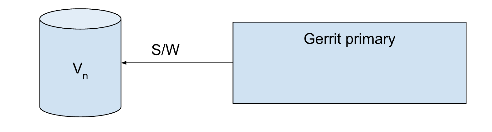

However, during an index schema upgrade the write indexes set consists of two
index versions, the old (Vn) and the new index version (Vn+1). The search index
is the old index version.

Online reindexing: W = {Vn, Vn+1}, S = Vn

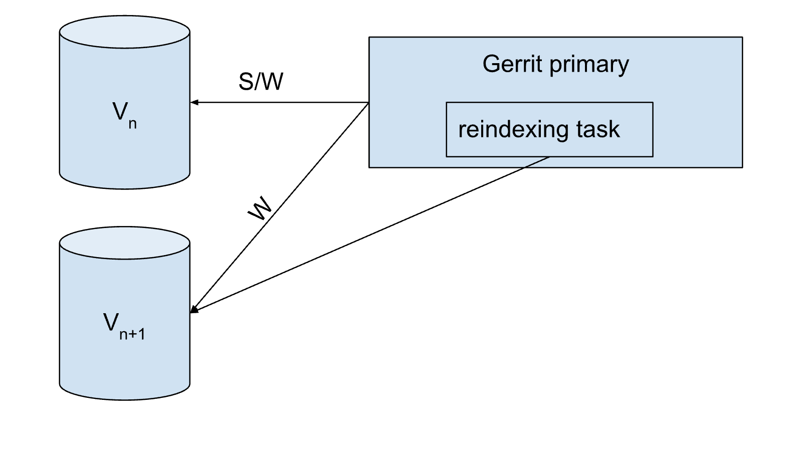

After online reindexing is completed Gerrit stops writing to the old index version
and uses the new index version only:

Normal operation: W = {Vn+1}, S = Vn+1

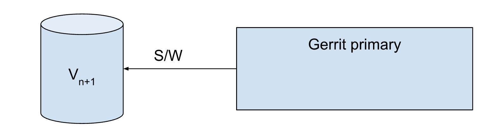

### Optimizing online reindexing

A major goal in optimizing online reindexing is to minimize the time that a Gerrit
primary server spends in the online reindexing mode. This can be achieved by
preparing the new index version outside of the Gerrit primary server process. The
design of the solution depends on whether a local Lucene index or a shared index
is used.

### Optimizations with local Lucene index

A technical limitation of the Lucene engine is that one index can only be open
from one JVM process. This limitation means that we cannot externalize the
background reindexing task into a separate JVM process because this would require
write access to the old and new index versions from both Gerrit primary's JVM
process and the JVM process running the background reindexing task. However, we
could prepare a copy of the new index version by running the reindexing task in
a separate JVM process. When the reindexing task is completed the created new
index version is made available to the Gerrit primary server. The new index
version is not completely up-to-date and the Gerrit primary needs to run full
online reindexing. However, this operation will be fast if the Gerrit primary
only reindexes stale entries or, in other words, reuses the existing index documents
which are up-to-date.

### Reusing existing index documents

[This change](https://gerrit-review.googlesource.com/c/gerrit/+/4048970) introduced
the feature of reusing existing documents when reindexing. This feature is a
building block for implementing optimized online reindexing:

* it provides a massive performance improvement when a large percentage of the
  index documents is up-to-date
* it doesn't delete existing documents when starting reindexing, which means that
  restarting Gerrit during reindexing is not an issue anymore.

### Preparing a new index schema version before index schema upgrade

To reuse existing index documents in the new index version it is necessary to
prepare the new index version. This can be done outside of the Gerrit primary
process. During this phase the primary Gerrit still runs on the old index version.
When the new index is ready it is copied to the Gerrit primary site and the
primary Gerrit is upgraded and the online index schema upgrade is performed with
the option to reuse existing documents. Gerrit primary will skip reindexing of
all up-to-date index documents and will only reindex those entities whose entries
in the index are stale. Based on our measurements, even for very large Gerrit
sites with more than 6 million of changes, this usually finishes in 1-2 hours.
Without the optimization the online index schema upgrade can take days to finish.

Preparation phase:

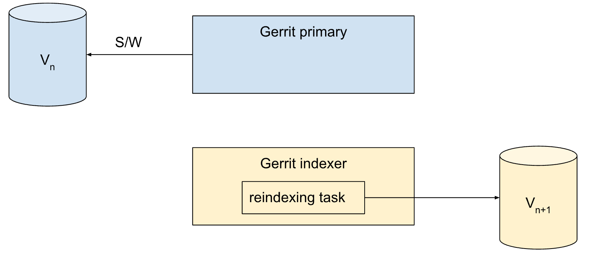

The online reindex phase uses already prepared Vn+1 index:

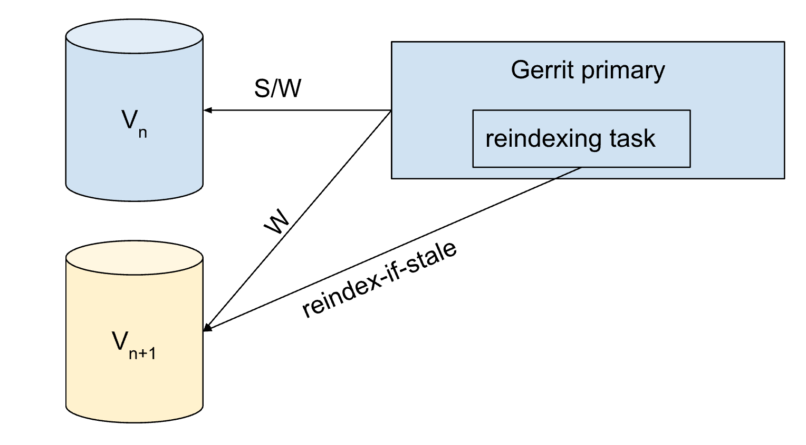

Online index schema upgrade completed:

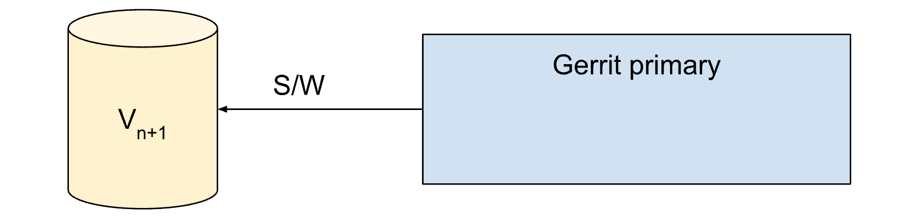

### Automation with k8s-gerrit

The previously described optimized upgrade process, if performed manually, is
significantly more complex than the default upgrade process. It is also error
prone as it depends on the human operator to execute the steps in the correct
order.

With the k8s-gerrit we have many possibilities to completely automate the
optimized index schema upgrade process.

#### Preparation of the new index version

This task can be implemented as a k8s job which runs on demand. The task performs
full reindexing and stops. The reindexing can be performed as offline, the
reindex program, or online, whatever is better suited for our needs. Note that
this job operates on its own index copy. When this job finishes, the created
indexes are copied to a shared volume that can be accessed from the primary
Gerrit servers.

#### Usage of the prepared new index version

The gerrit-init container copies the latest prepared new index version from a
shared storage to the index directory of the primary Gerrit container. This will
only happen if this index version is not yet present in the index directory of
this Gerrit primary. Thus, when the primary Gerrit starts it may already have a
new index version prepared. If an online index schema upgrade is needed it will
be performed with the option to reuse existing documents.

Note that the preparation and the usage of the new index version are fully
decoupled. The primary Gerrit server will make use of any prepared new index
version but it will also be able to perform index schema upgrades if the new
index version is not prepared.

Preparation:

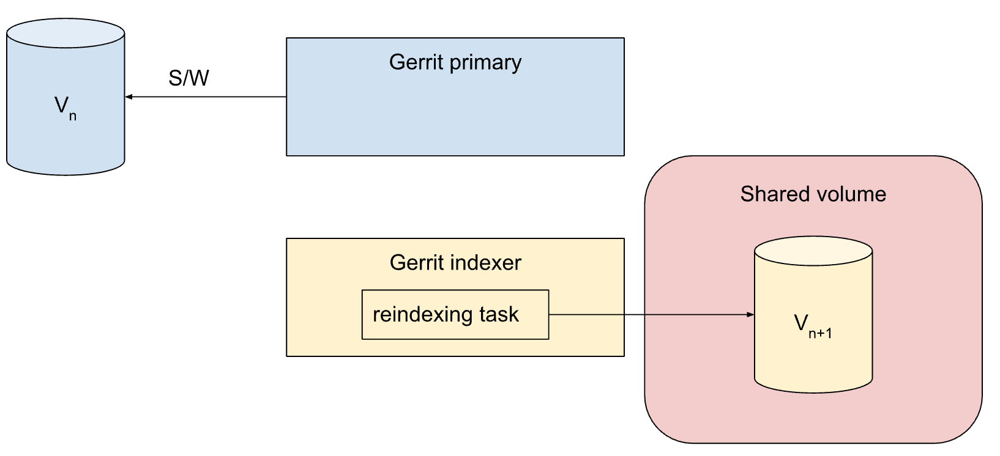

gerrit-init container run:

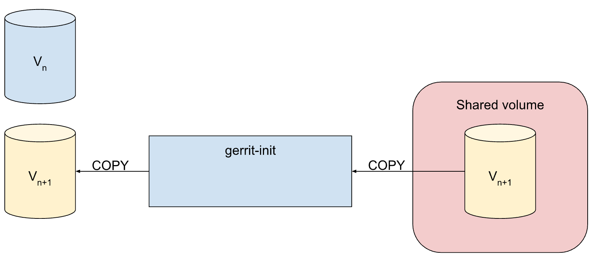

#### Versioning of the Gerrit containers

In order to prepare the new index version, the Gerrit indexer job needs to use a
container with the new Gerrit version. However, Gerrit primary needs to continue
using the old index version during the index preparation phase. While this can be
achieved by using a container with the old Gerrit version for running Gerrit
primary, it may be undesirable to use different Gerrit versions in different
containers. Ideally, all containers shall use the same Gerrit version. In order
to run Gerrit primary with the new Gerrit version we need to ensure that during
the new index version preparation it:

* uses the old index version as the search index
* does not trigger online index schema upgrade
* make the newly created index version available in the gerrit container
* gerrit-init container shall copy the new prepared index into the Gerrit site
* finalize online upgrade
* [optional] writes also in the new index version when indexing an entity

### Optimizations with a shared index

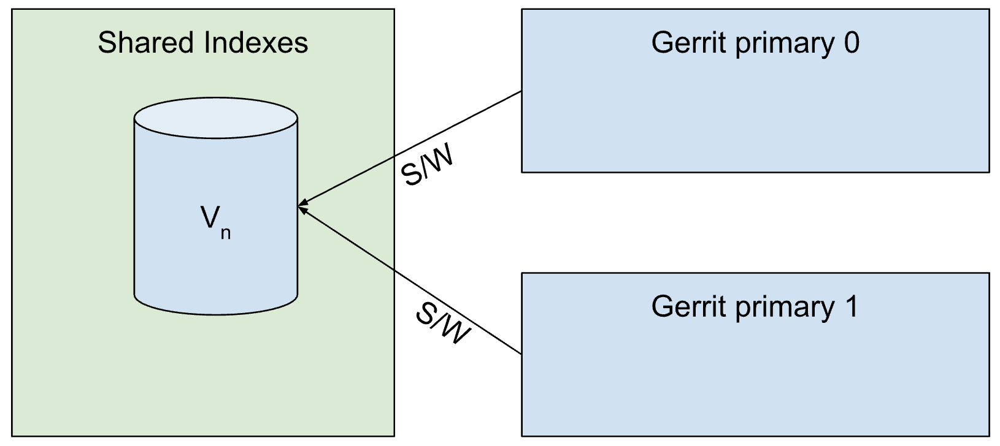

When using a shared index, for example based on OpenSearch or ElasticSearch,
then the limitation of using one index version from one Gerrit process is gone.
In this scenario, optimization of the online index schema upgrade is more
straightforward than in the case of using local Lucene indexes.

In this case, the default upgrade index schema upgrade process could be applied
with only one optimization:

#### Externalization of the background reindexing

In this scenario the background reindexing task is moved to run into a separate
container outside of the primary Gerrit process:

* Gerrit primary servers write into both old and new index versions and use the
  old index version as the search index.
* The background reindexing job runs in another container. Thus the load pattern
  on the primary server is unchanged during the reindexing.

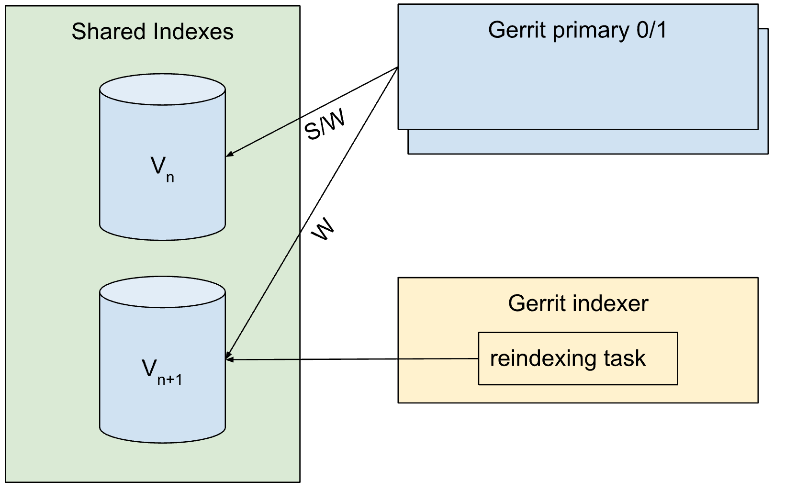

When the reindexing job finishes, Gerrit primary servers atomically switch to
using the new index version as the search index and continue writing into the
new index version only.


### Rollback after index schema upgrade

In case of performance or any other issues after an index schema upgrade sometimes
the only option may be to rollback to the previous Gerrit version. This requires
keeping the old index up-to-date for some time after switching to the new index
version. Technically, the write indexes set has to include the old index version
during that period. After a period of time where the new Gerrit version runs
smoothly, the old index version can be finally removed from the write set. With
that action, rollback to the Gerrit version that requires the old index version
is not anymore possible without recreating the old index version.

Normal operation, after online reindexing is completed, rollback possible:

W = {Vn, Vn+1}, S = Vn+1

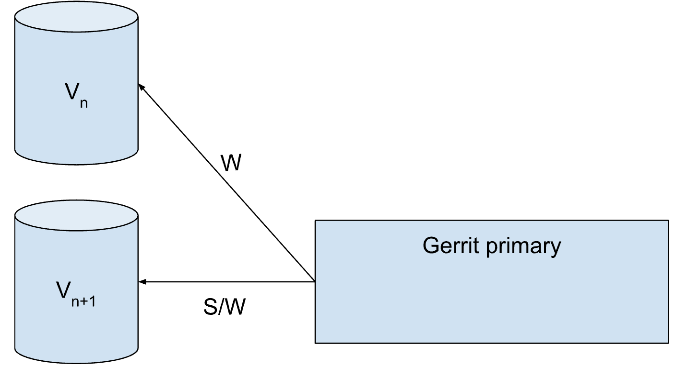

Normal operation, after online reindexing is completed, rollback impossible:

W = { Vn+1}, S = Vn+1

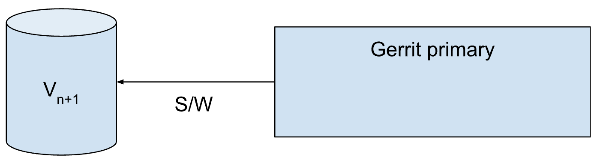


### Additional considerations

#### Support scaling up of Gerrit primary pods with local Lucene index

A challenge when scaling up Gerrit primary servers is to provide an up-to-date,
or nearly up-to-date, index for the new primary server(s) in a fully automated
way. A possible solution is to convert the "Gerrit indexer" job (see [Usage of
the prepared new index version](https://docs.google.com/document/d/1Hbvz7_SNLzDKFlnQabAzaWTiCtW8HinFmNSxG_Z02Gg/edit#heading=h.c93sq1mn47w2))
into a k8s cron job. In that solution, "Gerrit indexer" would run on a cron
schedule, for example every two hours.
Alternatively, index snapshots could be created from already running primary
Gerrits and provided to the new Gerrit instance.
This means that a nearly up-to-date index is available at any time on a shared
volume. When a new Gerrit primary server needs to be created, the gerrit-init
container would copy the index from the shared volume. The new Gerrit primary
server then needs to run a full reindexing of the latest index version with the
option to reuse existing index documents. The new Gerrit primary should be
declared ready to k8s until the reindexing is finished but it should join the HA
cluster and start receiving and processing HA messages immediately.

## How to upgrade indexes in k8s-gerrit

### Limitations

- This implementation requires a shared volume (e.g. NFS)
- At the moment, the implementation is not complete:
  - some manual steps are still required (described in the next sections)
  - shared indexes are not yet supported
  - rollbacks are not yet supported

### Preparing the new index versions

The Gerrit Operator provides the `GerritIndexer` CustomResource to prepare a new
index version. To make use of it, first the volumes containing the data have to
be prepared.

#### Preparing the Gerrit site volume

Since the Volume containing the Gerrit site, including the indexes and caches,
are running in `ReadWriteOnce` mode, it can't be mounted into the GerritIndexer
pod, while the primary Gerrit is still running. To solve this, create a
[VolumeSnapshot](https://kubernetes.io/docs/concepts/storage/volume-snapshots/)
of one of the site volumes, e.g.:

```yaml
apiVersion: snapshot.storage.k8s.io/v1
kind: VolumeSnapshot
metadata:
  name: gerrit-site-gerrit-primary-0-snapshot
  namespace: gerrit
spec:
  source:
    persistentVolumeClaimName: gerrit-site-gerrit-primary-0 # Name of the PVC containing a Gerrit site
  volumeSnapshotClassName: default
```

To be able to use the VolumeSnapshot as a Volume, create a PersistentVolumeClaim
like this:

```yaml
apiVersion: v1
kind: PersistentVolumeClaim
metadata:
  name: gerrit-site-gerrit-primary-0-snapshot
  namespace: gerrit
spec:
  dataSource:
    apiGroup: snapshot.storage.k8s.io
    kind: VolumeSnapshot
    name: gerrit-site-gerrit-primary-0-snapshot # Name of the VolumeSnapshot created above
  resources:
    requests:
      storage: 5Gi # Has to be the size configured for the primary Gerrit's site in the GerritCluster
  volumeMode: Filesystem
  accessModes:
    - ReadWriteOnce
```

#### Preparing the volume containing repositories

In k8s-gerrit, when using the high-availability setup, the repositories are
located on a shared volume. There are two options on how to mount this data
into the GerritIndexer pod:

* mount the same volume as the GerritCluster
* create a VolumeSnapshot

Since the Volume used to store repositories is required to use the `ReadWriteMany`
mode, it can directly be mounted into the GerritIndexer pod. The advantage is
that this requires less preparation and is cheaper. However, the GerritIndexer
might affect performance of the client-serving Gerrit instances by competing for
the resources of the NFS server.

To avoid that, a VolumeSnapshot can be used as for the other site components.
Note, that this will only be possible if a CSI driver for the filesystem being
used is available.

### Preparing Gerrit instances for the index schema upgrade

Before updating Gerrit to a version bringing a new version of an index, especially
the changes index, disable the online upgrade of the indexes (set
`index.onlineUpgrade` to `false`). Then update the version of the container images
to the version containing the new Gerrit version and apply the updated
GerritCluster resource. This will update Gerrit, but Gerrit will continue to use
the previous index versions. Note, that the groups and accounts indexes will
always be updated offline during startup. This of course only works, if the
new Gerrit version still supports the previous index version.

### Run the GerritIndexer

Create a GerritIndexer CustomResource like this example (see [reference](./operator-api-reference.md#gerritindexer)):

```yaml
apiVersion: "gerritoperator.google.com/v1beta9"
kind: GerritIndexer
metadata:
  name: gerrit-indexer
  namespace: gerrit
spec:
  # This has to match the name of the GerritCluster serving the data to be
  # indexed
  cluster: gerrit-cluster
  resources:
    requests:
      cpu: 2
      memory: 5Gi
    limits:
      cpu: 3
      memory: 6Gi
  # As for the client-serving Gerrit instances, the operator will enforce some
  # configuration
  configFiles:
    gerrit.config: |-
        [gerrit]
          serverId = gerrit-1
          disableReverseDnsLookup = true
        [index]
          type = LUCENE
        [auth]
          type = DEVELOPMENT_BECOME_ANY_ACCOUNT
        [httpd]
          requestLog = true
          gracefulStopTimeout = 1m
        [transfer]
          timeout = 120 s
        [user]
          name = Gerrit Code Review
          email = gerrit@example.com
          anonymousCoward = Unnamed User
        [container]
          javaOptions = -Xms200m
          javaOptions = -Xmx4g
  storage:
    site:
      # The name of the PVC containing the Gerrit site
      persistentVolumeClaim: gerrit-site-gerrit-0-snapshot
    repositories:
      # The name of the PVC containing the repositories
      persistentVolumeClaim: shared-pvc
      # The path in the mounted volume containing the repositories
      subPath: git
    output:
      # The name of the PVC to use for storing the new indexes
      persistentVolumeClaim: shared-pvc
      # The path in the mounted volume where to store the indexes
      subPath: shared/indexes
```

It is highly recommended to use the shared volume used by the GerritCluster with
a subPath under `shared` to store the new index versions, since this way the
indexes will be available right away in the Gerrit pods. This is the case by
default.

When the GerritIndexer is applied to the cluster, the Gerrit Operator will create
a Job that will run offline reindexing on the repositories. It will use the caches
available in the mounted site. After the indexes were created, they will be copied
to the output volume.

### Apply the updated indexes

***This step is currently not automated and requires manual steps.***

Go into each primary Gerrit pod and copy the new indexes to the index directory
in the Gerrit site.

Now, set `index.onlineUpgrade` and `index.reuseExistingDocuments` to `true`.
When applying the updated Gerrit config (by applying the updated GerritCluster
resource), the Gerrit pods will restart and start online reindexing. Since most
entries will already be available in the index, only changes updated in the
meantime will be reindexed.

### Cleanup

Since Kubernetes Jobs are immutable after running, it is recommended to delete
the GerritIndexer CustomResource after the index upgrade has been completed.
